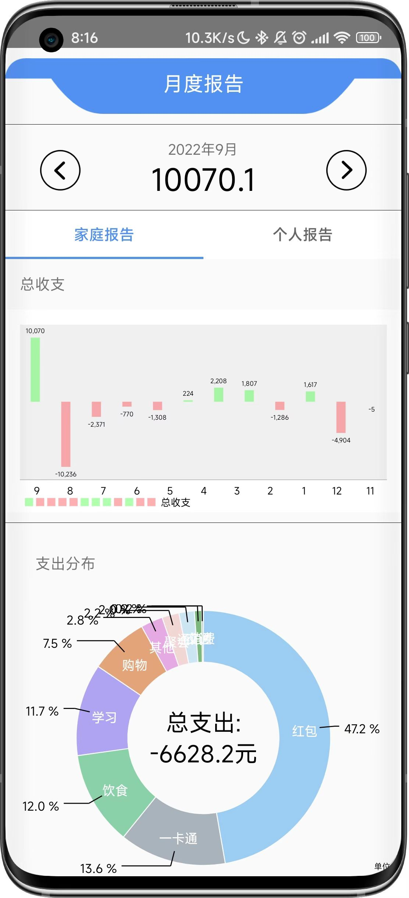
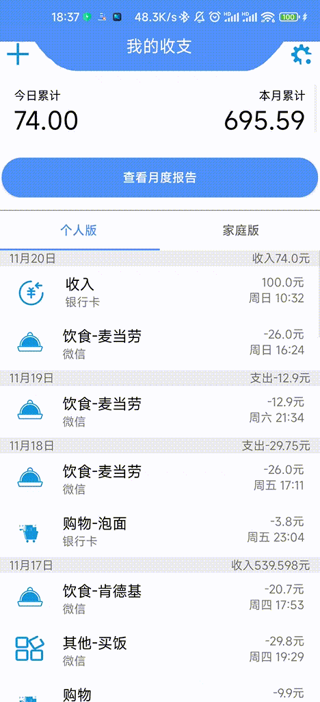
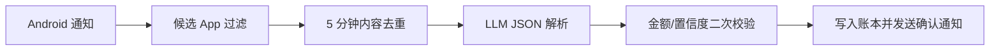

# AutoBookKeepingBeta


自动记账是一个 Android 端个人/家庭账本应用，目标是用尽量少的手动输入完成日常收支记录、分类统计和云端同步。项目当前重点能力包括通知账单识别、家庭账本、多维账单查询、月度报表、自定义分类和本地/云端数据同步。

> 使用文档已迁移到 [Wiki](https://github.com/FuShengDuoBuYu/AutoBookKeepingBeta/wiki)。

## 功能特性

- **通知账单识别**：监听支付宝、微信、银行、美团、京东等候选 App 的通知，并通过云端 LLM 解析账单结构。
- **AI 防误判策略**：用严格 prompt 让 LLM 判断小荷包成员、待支付提醒、金额来源和账单真伪，App 侧只保留必要的来源过滤、去重和结果校验。
- **个人/家庭账本**：支持个人账本和家庭账本切换，家庭成员账单可统一查看。
- **月度报表**：提供支出分布、历史月份切换、个人/家庭维度报表。
- **账单管理**：支持新增、删除、修改、按时间/类别/关键字等组合查询历史账单。
- **云端同步**：登录后同步用户资料和账单数据，降低换机或重装后的数据迁移成本。
- **自定义分类**：支持自定义账单类型，并在图表和筛选中复用。

## 预览

| 首页 | 月度报表 | 设置 |
| --- | --- | --- |
|  |  |  |

## 项目架构

```text
AutoBookKeepingBeta
├── AutoBookKeeping/              # Android 工程
│   ├── app/
│   │   ├── src/main/java/Util/   # 通用工具、账单解析、网络与数据写入逻辑
│   │   ├── src/main/java/com/beta/autobookkeeping/
│   │   │   ├── activity/         # 页面与交互
│   │   │   ├── fragment/         # 首页、报表、账单详情等组件
│   │   │   ├── service/          # 通知监听、快捷开关、通知操作
│   │   │   └── widget/           # 桌面小组件
│   │   └── src/main/res/         # 布局、图标、主题、动画资源
│   ├── build.gradle
│   └── settings.gradle
├── ReadmeImage/                  # README 和 Wiki 使用的截图素材
├── LICENSE
└── Readme.md
```

## AI 账单解析流程



当前 LLM 接口使用 OpenAI-compatible API：

- Endpoint: `POST /v1/chat/completions`
- 默认模型：`qwen3.5:9b`
- 推荐参数：`think=false`、`stream=false`、`response_format={"type":"json_object"}`、`num_ctx=93696`

## 通知识别范围

为了减少隐私暴露和无意义调用，应用只会把潜在账单来源发送给 LLM。当前候选范围包括：

- 支付宝、微信、云闪付
- 美团、大众点评、京东、京东金融
- 主流银行与信用卡 App
- App 名称包含“银行 / 信用卡 / 支付宝 / 微信 / 云闪付 / 美团 / 京东”等关键词的应用

App 侧尽量不做账单语义判断。待支付、未支付、自动取消、验证码、登录、配置更新、小荷包成员匹配、是否存在明确金额等判断主要由 LLM 根据 prompt 完成；本地只保留 5 分钟内相同内容和金额的重复通知拦截，以及 LLM 返回后的金额/置信度兜底校验。

## 版本记录

### v1.4

- 新增全局公告能力，首页可接收后端下发公告弹窗。
- 新增登录后用户资料和账单云端同步流程。
- 后端升级为模块化 FastAPI 路由架构。
- 修复月度报告历史月份切换、数据库资源关闭、账单修改文案等问题。

### v1.3

- 通知读取替代短信读取。
- 新增支付宝小荷包账单识别。
- 新增自定义账单类型。
- 支持删除和修改过往任意时间的账单。

### v1.2

- 新增家庭版和个人版快速切换。
- 新增家庭信息与成员管理。
- 重构 UI、动画、设置页和月度报告。
- 支持云端账单备份。

## Star History

<a href="https://www.star-history.com/?repos=FuShengDuoBuYu%2FAutoBookKeepingBeta&type=date&legend=top-left">
 <picture>
   <source media="(prefers-color-scheme: dark)" srcset="https://api.star-history.com/chart?repos=FuShengDuoBuYu/AutoBookKeepingBeta&type=date&theme=dark&legend=top-left&sealed_token=2Axdzd3TlGg6oRp1OWlXdJ9JRnurUTvchRDND356e1Cy1HNNR18CJrkSzg8Eng1PMafW2c4hmEOjZxsvXttCP8dzv16T-eXciqV9Ai4Ed2lh0Nfrvpy8xw" />
   <source media="(prefers-color-scheme: light)" srcset="https://api.star-history.com/chart?repos=FuShengDuoBuYu/AutoBookKeepingBeta&type=date&legend=top-left&sealed_token=2Axdzd3TlGg6oRp1OWlXdJ9JRnurUTvchRDND356e1Cy1HNNR18CJrkSzg8Eng1PMafW2c4hmEOjZxsvXttCP8dzv16T-eXciqV9Ai4Ed2lh0Nfrvpy8xw" />
   
 </picture>
</a>
## 贡献

欢迎提交 Issue 或 Pull Request。建议在提交前说明问题场景、复现步骤、期望行为和相关日志；涉及通知识别的改动，请尽量附上脱敏后的通知样例。

## 许可证

本项目基于 [MIT License](LICENSE) 开源。
